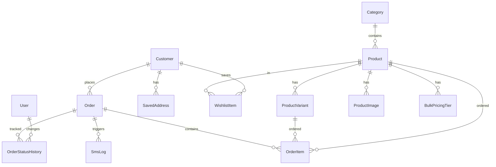

# Database Schema

This document describes the database schema for the Hardware Store application.

## Overview

The database uses **SQLite** for development and **PostgreSQL** for production. The schema is managed by [Prisma ORM](https://www.prisma.io/).

## Entity Relationship Diagram



---

## Models

### User (Admin)

Admin users who manage the store through the dashboard.

| Column | Type | Description |
|--------|------|-------------|
| id | Int | Primary key |
| username | String | Unique username |
| password | String | Hashed password |
| name | String | Display name |
| role | String | "admin" or "staff" |
| isActive | Boolean | Account status |
| lastLogin | DateTime? | Last login timestamp |
| createdAt | DateTime | Created timestamp |
| updatedAt | DateTime | Updated timestamp |

**Indexes:** `username` (unique)

---

### Customer

Customer accounts for the storefront.

| Column | Type | Description |
|--------|------|-------------|
| id | Int | Primary key |
| email | String | Unique email address |
| password | String | Hashed password |
| name | String | Full name |
| phone | String? | Phone number |
| isActive | Boolean | Account status |
| lastLogin | DateTime? | Last login timestamp |
| createdAt | DateTime | Created timestamp |
| updatedAt | DateTime | Updated timestamp |

**Indexes:** `email` (unique)

**Relations:**
- `orders` → Order[]
- `savedAddresses` → SavedAddress[]
- `wishlistItems` → WishlistItem[]

---

### Category

Product categories for organization.

| Column | Type | Description |
|--------|------|-------------|
| id | Int | Primary key |
| name | String | Category name (unique) |
| description | String? | Category description |
| icon | String? | Emoji or icon name |
| isDeleted | Boolean | Soft delete flag |
| createdAt | DateTime | Created timestamp |
| updatedAt | DateTime | Updated timestamp |

**Indexes:** `name` (unique)

---

### Product

Products available for sale.

| Column | Type | Description |
|--------|------|-------------|
| id | Int | Primary key |
| name | String | Product name |
| description | String? | Product description |
| price | Float | Base price in PHP |
| unit | String | Unit of measure |
| sku | String? | Stock keeping unit (unique) |
| imageUrl | String? | Primary image URL |
| stockQuantity | Int | Current stock level |
| lowStockThreshold | Int | Low stock alert level |
| isAvailable | Boolean | Availability status |
| isDeleted | Boolean | Soft delete flag |
| hasVariants | Boolean | Uses variants |
| hasBulkPricing | Boolean | Has volume discounts |
| categoryId | Int | Foreign key to Category |
| createdAt | DateTime | Created timestamp |
| updatedAt | DateTime | Updated timestamp |

**Indexes:** `categoryId`, `name`, `isAvailable`, `isDeleted`, `sku` (unique)

**Relations:**
- `category` → Category
- `variants` → ProductVariant[]
- `images` → ProductImage[]
- `bulkPricingTiers` → BulkPricingTier[]
- `orderItems` → OrderItem[]
- `wishlistItems` → WishlistItem[]

---

### ProductVariant

Variations of a product (size, color, etc.).

| Column | Type | Description |
|--------|------|-------------|
| id | Int | Primary key |
| productId | Int | Foreign key to Product |
| name | String | Variant name (e.g., "Large - Red") |
| sku | String? | Variant SKU (unique) |
| price | Float | Variant price |
| stockQuantity | Int | Variant stock level |
| attributes | String? | JSON attributes |
| isAvailable | Boolean | Availability status |
| isDeleted | Boolean | Soft delete flag |
| createdAt | DateTime | Created timestamp |
| updatedAt | DateTime | Updated timestamp |

**Indexes:** `productId`, `sku` (unique)

**Attributes JSON Example:**
```json
{ "size": "Large", "color": "Red" }
```

---

### ProductImage

Additional images for a product.

| Column | Type | Description |
|--------|------|-------------|
| id | Int | Primary key |
| productId | Int | Foreign key to Product |
| imageUrl | String | Image URL |
| altText | String? | Alt text for accessibility |
| sortOrder | Int | Display order |
| isPrimary | Boolean | Primary image flag |
| createdAt | DateTime | Created timestamp |

**Indexes:** `productId`

---

### BulkPricingTier

Volume discount tiers for products.

| Column | Type | Description |
|--------|------|-------------|
| id | Int | Primary key |
| productId | Int | Foreign key to Product |
| minQuantity | Int | Minimum quantity for tier |
| discountType | String | "percentage" or "fixed" |
| discountValue | Float | Discount amount |
| createdAt | DateTime | Created timestamp |

**Indexes:** `productId`

**Example:**
| minQuantity | discountType | discountValue |
|-------------|--------------|---------------|
| 10 | percentage | 5 |
| 25 | percentage | 10 |
| 50 | percentage | 15 |

---

### Order

Customer orders.

| Column | Type | Description |
|--------|------|-------------|
| id | Int | Primary key |
| orderNumber | String | Unique order number |
| customerId | Int? | Foreign key to Customer (optional) |
| customerName | String | Customer full name |
| phone | String | Customer phone |
| address | String | Delivery address |
| barangay | String | Barangay name |
| landmarks | String? | Nearby landmarks |
| status | String | Order status |
| totalAmount | Float | Total order amount |
| notes | String? | Customer notes |
| createdAt | DateTime | Created timestamp |
| updatedAt | DateTime | Updated timestamp |

**Indexes:** `status`, `phone`, `orderNumber` (unique), `createdAt`, `customerId`

**Order Number Format:** `HW-YYYYMMDD-XXXX` (e.g., HW-20241218-0042)

**Statuses:** `pending`, `accepted`, `rejected`, `preparing`, `out_for_delivery`, `delivered`, `completed`, `cancelled`

---

### OrderItem

Individual items within an order.

| Column | Type | Description |
|--------|------|-------------|
| id | Int | Primary key |
| orderId | Int | Foreign key to Order |
| productId | Int | Foreign key to Product |
| variantId | Int? | Foreign key to ProductVariant |
| variantName | String? | Variant name at time of order |
| quantity | Int | Quantity ordered |
| unitPrice | Float | Price at time of order |
| subtotal | Float | quantity × unitPrice |

**Indexes:** `orderId`, `productId`, `variantId`

---

### SmsLog

SMS notification history.

| Column | Type | Description |
|--------|------|-------------|
| id | Int | Primary key |
| orderId | Int? | Foreign key to Order |
| phone | String | Recipient phone number |
| message | String | SMS message content |
| status | String | "pending", "sent", or "failed" |
| sentAt | DateTime? | When SMS was sent |
| error | String? | Error message if failed |
| response | String? | Provider response |
| createdAt | DateTime | Created timestamp |

**Indexes:** `orderId`, `status`

---

### OrderStatusHistory

Audit trail for order status changes.

| Column | Type | Description |
|--------|------|-------------|
| id | Int | Primary key |
| orderId | Int | Foreign key to Order |
| fromStatus | String? | Previous status |
| toStatus | String | New status |
| changedById | Int? | Foreign key to User |
| notes | String? | Change notes |
| createdAt | DateTime | Created timestamp |

**Indexes:** `orderId`, `changedById`, `createdAt`

---

### SavedAddress

Customer saved delivery addresses.

| Column | Type | Description |
|--------|------|-------------|
| id | Int | Primary key |
| customerId | Int | Foreign key to Customer |
| label | String | Address label (Home, Office) |
| address | String | Street address |
| barangay | String | Barangay name |
| landmarks | String? | Nearby landmarks |
| isDefault | Boolean | Default address flag |
| createdAt | DateTime | Created timestamp |
| updatedAt | DateTime | Updated timestamp |

**Indexes:** `customerId`

---

### WishlistItem

Customer wishlist/favorites.

| Column | Type | Description |
|--------|------|-------------|
| id | Int | Primary key |
| customerId | Int | Foreign key to Customer |
| productId | Int | Foreign key to Product |
| addedAt | DateTime | When added to wishlist |

**Indexes:** `customerId`, `productId`

**Unique Constraint:** `customerId + productId`

---

## Common Commands

### View Database (Prisma Studio)

```bash
cd backend
npm run db:studio
```

Opens a visual database browser at http://localhost:5555.

### Run Migrations

```bash
# Development
npm run db:migrate

# Production
npm run db:deploy
```

### Reset Database

```bash
npm run db:reset
```

### Seed Database

```bash
npm run db:seed
```

### Generate Prisma Client

```bash
npx prisma generate
```
