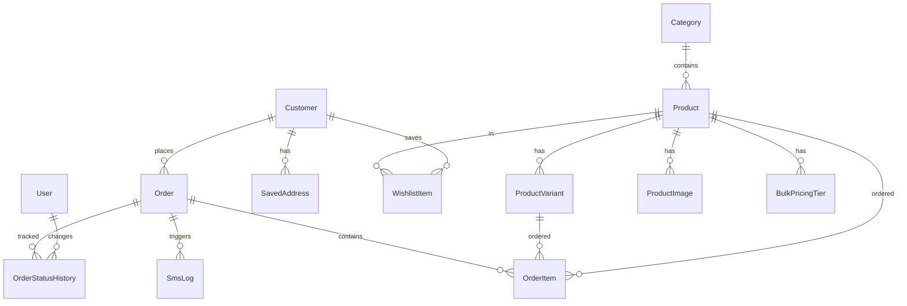

# Database Schema

This document describes every table in the database, what each column stores, and how the tables relate to each other. The schema is defined in `backend/prisma/schema.prisma` and managed through Prisma ORM.

## Database Engine

- **Local development:** SQLite — a file-based database that requires zero configuration
- **Production (Railway):** PostgreSQL — a proper relational database for reliability and concurrent access

Prisma handles the differences between the two engines automatically, so the same schema works in both environments.

## Entity Relationship Diagram

The diagram below shows how the main tables connect to each other. Each line represents a foreign key relationship.


```mermaid
erDiagram
    User ||--o{ OrderStatusHistory : "changes"
    Customer ||--o{ Order : "places"
    Customer ||--o{ SavedAddress : "has"
    Customer ||--o{ WishlistItem : "saves"
    Category ||--o{ Product : "contains"
    Product ||--o{ ProductVariant : "has"
    Product ||--o{ ProductImage : "has"
    Product ||--o{ BulkPricingTier : "has"
    Product ||--o{ OrderItem : "ordered"
    Product ||--o{ WishlistItem : "in"
    ProductVariant ||--o{ OrderItem : "ordered"
    Order ||--o{ OrderItem : "contains"
    Order ||--o{ SmsLog : "triggers"
    Order ||--o{ OrderStatusHistory : "tracked"
```

---

## Tables

### User

Stores admin and staff accounts that log into the dashboard to manage the store.

| Column | Type | Description |
|--------|------|-------------|
| id | Int | Auto-incrementing primary key |
| username | String | Login username — must be unique |
| password | String | Bcrypt-hashed password |
| name | String | Display name shown in the dashboard |
| role | String | Either `"admin"` (full access) or `"staff"` (limited access) |
| isActive | Boolean | Whether this account can log in |
| lastLogin | DateTime (nullable) | Timestamp of the most recent login |
| createdAt | DateTime | When the account was created |
| updatedAt | DateTime | When the account was last modified |

Unique index on `username`.

---

### Customer

Customer accounts created through the storefront registration form.

| Column | Type | Description |
|--------|------|-------------|
| id | Int | Auto-incrementing primary key |
| email | String | Login email — must be unique |
| password | String | Bcrypt-hashed password |
| name | String | Customer's full name |
| phone | String (nullable) | Philippine mobile number |
| isActive | Boolean | Whether this account is active |
| lastLogin | DateTime (nullable) | Timestamp of the most recent login |
| createdAt | DateTime | Account creation timestamp |
| updatedAt | DateTime | Last modification timestamp |

Unique index on `email`.

Each customer can have multiple orders, saved addresses, and wishlist items.

---

### Category

Product categories used to organize the catalog (e.g., "Tools", "Plumbing", "Electrical").

| Column | Type | Description |
|--------|------|-------------|
| id | Int | Auto-incrementing primary key |
| name | String | Category name — must be unique |
| description | String (nullable) | Short description of the category |
| icon | String (nullable) | An emoji or icon identifier displayed in the UI |
| isDeleted | Boolean | Soft delete flag — hidden from the storefront but retained in the database |
| createdAt | DateTime | Creation timestamp |
| updatedAt | DateTime | Last modification timestamp |

Unique index on `name`.

---

### Product

Every item available for sale in the store.

| Column | Type | Description |
|--------|------|-------------|
| id | Int | Auto-incrementing primary key |
| name | String | Product name |
| description | String (nullable) | Detailed product description |
| price | Float | Base price in Philippine pesos |
| unit | String | Unit of measure (e.g., "piece", "kg", "meter", "bag") |
| sku | String (nullable) | Stock Keeping Unit code — unique identifier for inventory |
| imageUrl | String (nullable) | Path to the primary product image |
| stockQuantity | Int | How many units are currently in stock |
| lowStockThreshold | Int | When stock drops to this level, a low-stock warning is triggered |
| isAvailable | Boolean | Whether the product is visible and orderable on the storefront |
| isDeleted | Boolean | Soft delete flag |
| hasVariants | Boolean | Whether this product has variants (sizes, colors, etc.) |
| hasBulkPricing | Boolean | Whether bulk pricing tiers apply to this product |
| categoryId | Int | Foreign key linking to the Category table |
| createdAt | DateTime | Creation timestamp |
| updatedAt | DateTime | Last modification timestamp |

Indexes on `categoryId`, `name`, `isAvailable`, `isDeleted`. Unique index on `sku`.

Each product belongs to one category and can have multiple variants, images, bulk pricing tiers, order items, and wishlist entries.

---

### ProductVariant

Represents a specific variation of a product — for example, different sizes or colors of the same item.

| Column | Type | Description |
|--------|------|-------------|
| id | Int | Auto-incrementing primary key |
| productId | Int | Foreign key to the parent Product |
| name | String | Human-readable variant name (e.g., "Large - Red") |
| sku | String (nullable) | Variant-specific SKU — unique |
| price | Float | Price for this particular variant |
| stockQuantity | Int | Stock level for this variant specifically |
| attributes | String (nullable) | JSON string with structured attributes |
| isAvailable | Boolean | Whether this variant can be ordered |
| isDeleted | Boolean | Soft delete flag |
| createdAt | DateTime | Creation timestamp |
| updatedAt | DateTime | Last modification timestamp |

Indexes on `productId`. Unique index on `sku`.

The `attributes` field stores variant properties as JSON, for example:
```json
{ "size": "Large", "color": "Red" }
```

---

### ProductImage

Additional images for a product beyond the primary one. Used for gallery views on the product detail page.

| Column | Type | Description |
|--------|------|-------------|
| id | Int | Auto-incrementing primary key |
| productId | Int | Foreign key to Product |
| imageUrl | String | Path to the image file |
| altText | String (nullable) | Descriptive text for accessibility |
| sortOrder | Int | Controls the display order in the gallery |
| isPrimary | Boolean | Marks which image is shown as the main thumbnail |
| createdAt | DateTime | When the image record was created |

Index on `productId`.

---

### BulkPricingTier

Defines volume discounts for a product. Customers ordering in large quantities automatically get a reduced price.

| Column | Type | Description |
|--------|------|-------------|
| id | Int | Auto-incrementing primary key |
| productId | Int | Foreign key to Product |
| minQuantity | Int | Minimum order quantity to qualify for this tier |
| discountType | String | `"percentage"` (e.g., 10% off) or `"fixed"` (e.g., ₱5 off per unit) |
| discountValue | Float | The discount amount |
| createdAt | DateTime | Creation timestamp |

Index on `productId`.

For example, a product might have these tiers:

| Minimum Quantity | Discount |
|------------------|----------|
| 10 units | 5% off |
| 25 units | 10% off |
| 50 units | 15% off |

---

### Order

Each row represents one customer order. Orders are placed through the storefront and managed by admin staff.

| Column | Type | Description |
|--------|------|-------------|
| id | Int | Auto-incrementing primary key |
| orderNumber | String | Human-readable order number in the format `HW-YYYYMMDD-XXXX` |
| customerId | Int (nullable) | Foreign key to Customer — null for guest checkouts |
| customerName | String | Customer's name (stored directly for display even if customer account is deleted) |
| phone | String | Customer's phone number for SMS notifications |
| address | String | Delivery street address |
| barangay | String | Barangay (neighborhood/district) for the delivery |
| landmarks | String (nullable) | Nearby landmarks to help the driver find the address |
| status | String | Current order status (see status list below) |
| totalAmount | Float | Total cost of all items in the order |
| notes | String (nullable) | Special instructions from the customer |
| createdAt | DateTime | When the order was placed |
| updatedAt | DateTime | Last status change timestamp |

Indexes on `status`, `phone`, `createdAt`, `customerId`. Unique index on `orderNumber`.

**Order statuses:** `pending` → `accepted` → `preparing` → `out_for_delivery` → `delivered` → `completed`. Orders can also be `rejected` or `cancelled` at certain stages.

---

### OrderItem

Individual line items within an order. Each row represents one product (and optionally a specific variant) at a specific quantity.

| Column | Type | Description |
|--------|------|-------------|
| id | Int | Auto-incrementing primary key |
| orderId | Int | Foreign key to Order |
| productId | Int | Foreign key to Product |
| variantId | Int (nullable) | Foreign key to ProductVariant (if a variant was selected) |
| variantName | String (nullable) | Variant name captured at time of order (so it is preserved even if the variant is later changed) |
| quantity | Int | Number of units ordered |
| unitPrice | Float | Price per unit at the time of purchase |
| subtotal | Float | `quantity × unitPrice` |

Indexes on `orderId`, `productId`, `variantId`.

---

### SmsLog

Records every SMS the system attempts to send. Useful for debugging delivery failures and auditing message history.

| Column | Type | Description |
|--------|------|-------------|
| id | Int | Auto-incrementing primary key |
| orderId | Int (nullable) | Foreign key to the Order that triggered this SMS |
| phone | String | Recipient phone number |
| message | String | Full text of the message |
| status | String | `"pending"`, `"sent"`, or `"failed"` |
| sentAt | DateTime (nullable) | When the SMS was successfully delivered |
| error | String (nullable) | Error details if the send failed |
| response | String (nullable) | Raw JSON response from the SMS provider |
| createdAt | DateTime | When the log entry was created |

Indexes on `orderId`, `status`.

---

### OrderStatusHistory

An audit trail that records every status change for an order. This powers the order timeline view in both the customer tracker and admin dashboard.

| Column | Type | Description |
|--------|------|-------------|
| id | Int | Auto-incrementing primary key |
| orderId | Int | Foreign key to Order |
| fromStatus | String (nullable) | The previous status (null for the initial "pending" entry) |
| toStatus | String | The new status |
| changedById | Int (nullable) | Foreign key to User — which admin/staff made this change |
| notes | String (nullable) | Optional notes recorded with the status change |
| createdAt | DateTime | When the status change occurred |

Indexes on `orderId`, `changedById`, `createdAt`.

---

### SavedAddress

Delivery addresses that customers can save to their account for reuse on future orders.

| Column | Type | Description |
|--------|------|-------------|
| id | Int | Auto-incrementing primary key |
| customerId | Int | Foreign key to Customer |
| label | String | A friendly label like "Home" or "Office" |
| address | String | Street address |
| barangay | String | Barangay name |
| landmarks | String (nullable) | Nearby landmarks |
| isDefault | Boolean | Whether this is the customer's default delivery address |
| createdAt | DateTime | Creation timestamp |
| updatedAt | DateTime | Last modification timestamp |

Index on `customerId`.

---

### WishlistItem

Tracks which products a customer has saved to their wishlist/favorites list.

| Column | Type | Description |
|--------|------|-------------|
| id | Int | Auto-incrementing primary key |
| customerId | Int | Foreign key to Customer |
| productId | Int | Foreign key to Product |
| addedAt | DateTime | When the item was added to the wishlist |

Indexes on `customerId`, `productId`. There is a unique constraint on the combination of `customerId + productId` so a customer cannot add the same product twice.

---

## Common Database Commands

**Open Prisma Studio** (visual database browser):
```bash
cd backend
npm run db:studio
```
Opens at `http://localhost:5555`.

**Run pending migrations:**
```bash
cd backend
npm run db:migrate        # for development (creates migration files)
npm run db:deploy         # for production (applies existing migrations only)
```

**Reset the database** (drops everything and re-seeds):
```bash
cd backend
npm run db:reset
```

**Seed the database:**
```bash
cd backend
npm run db:seed
```

**Regenerate the Prisma client** (needed after schema changes):
```bash
cd backend
npx prisma generate
```
