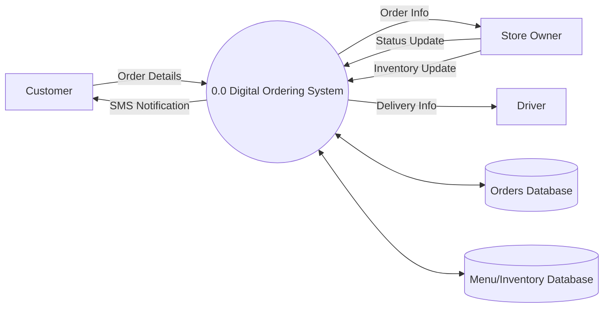
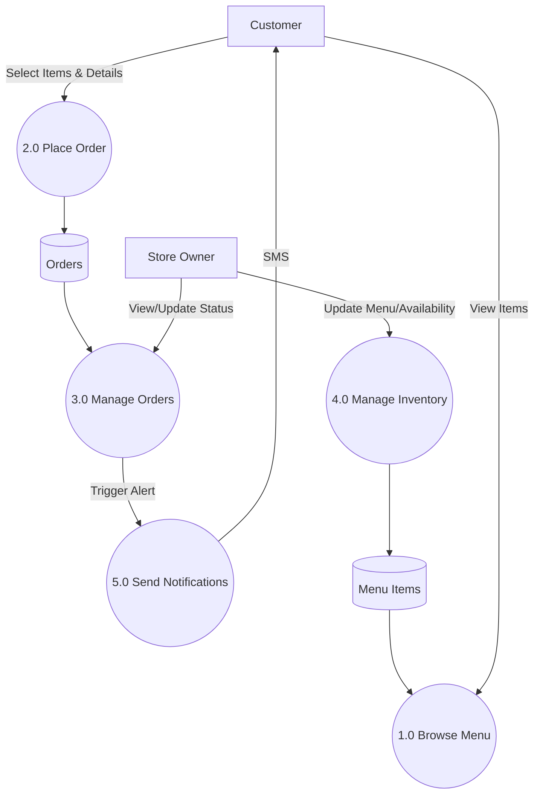
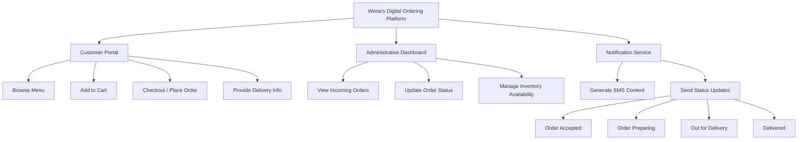

# III. Proposed Solution

## A. Functional Requirements

Based on the system features and project requirements, the following functional requirements have been identified:

1.  **Customer Portal**
    *   **FR-01 Browse Menu**: The system shall allow customers to view a list of menu items with photos, descriptions, and pricing.
    *   **FR-02 Manage Cart**: The system shall allow customers to select items and add them to a shopping cart.
    *   **FR-03 Checkout**: The system shall allow customers to complete a checkout process by providing their name, delivery address, and phone number.
    *   **FR-04 View Order Status**: The system shall allow customers to receive updates on their order status (Accepted, Preparing, Out for Delivery, Delivered).

2.  **Administrative Dashboard**
    *   **FR-05 View Orders**: The system shall provide a dashboard for the store owner to view all incoming orders and customer details.
    *   **FR-06 Manage Order Status**: The system shall allow the store owner to update the status of an order (e.g., Accept, Mark as Out for Delivery).
    *   **FR-07 Manage Inventory**: The system shall allow the store owner to mark items as "unavailable" to prevent customers from ordering out-of-stock items.

3.  **Automated Notifications**
    *   **FR-08 SMS Alerts**: The system shall automatically send SMS notifications to the customer when the order status changes.

## B. Non-functional Requirements

The following non-functional requirements define the constraints and quality attributes of the system:

1.  **Platform Constraints**
    *   **NFR-01 Web-Based**: The solution must be a web-based application accessible via standard web browsers.
    *   **NFR-02 Mobile Responsiveness**: The website should be responsive and usable on mobile devices for customers.

2.  **Operational Constraints**
    *   **NFR-03 Payment Method**: The system shall only support "Cash on Delivery" (COD) as the payment method. Online payment processing is excluded.
    *   **NFR-04 Delivery Tracking**: The system shall not support GPS-based tracking. Drivers will rely on the text address provided by the customer.
    *   **NFR-05 Manual Stock Management**: Stock levels are not decremented automatically; the owner manually toggles availability.

3.  **Data Retention**
    *   **NFR-06 Digital Records**: All orders must be stored digitally to eliminate paper-based record-keeping.

## C. Proposed System Flow

### i. Context Diagram

The Context Diagram illustrates the boundaries of the "Wena’s Digital Ordering Platform" and its interactions with external entities.

```mermaid
contextDiagram
    Customer --> System: Places Order, Provides Info
    System --> Customer: Order Confirmation, SMS Status Updates
    StoreOwner --> System: Updates Order Status, Manages Inventory
    System --> StoreOwner: Order Details
    System --> Driver: Delivery Information
```

*Note: In this context, the Driver receives information indirectly or physically, but conceptually the system provides the data needed for delivery.*

### ii. Level 0 DFD (Data Flow Diagram)

The Level 0 DFD shows the high-level process of the Ordering System.



### iii. Level 1 DFD

The Level 1 DFD breaks down the main system into its sub-processes.



### iv. Decomposition (Functional Decomposition Chart)

This hierarchical chart breaks down the system features into manageable functions.


